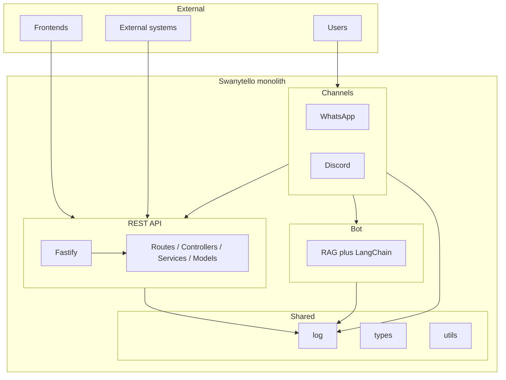
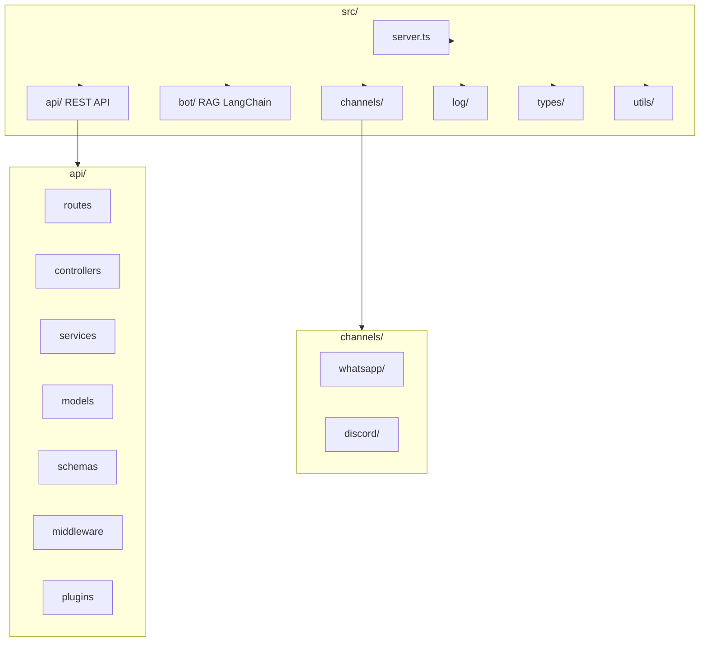
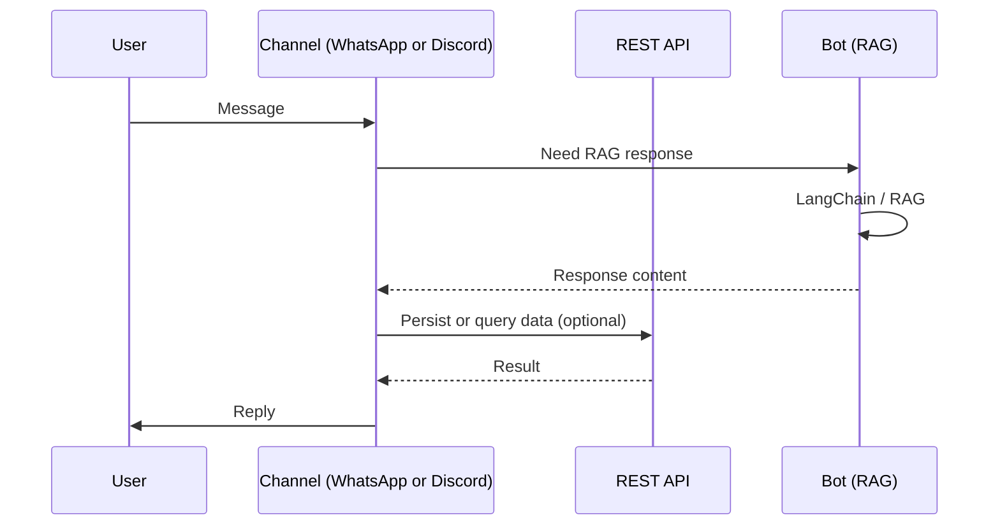

# Swanytello

Projeto desenvolvido para a comunidade Sorocode, unindo os projetos SwanyBot e DonatelloBot.

---

## Navigation

- [Swanytello](#swanytello)
  - [Navigation](#navigation)
  - [Architecture](#architecture)
    - [Visual overview](#visual-overview)
  - [Getting started](#getting-started)
  - [Scripts](#scripts)
  - [Project structure](#project-structure)
  - [Documentation](#documentation)

---

## Architecture

This repository is a **monolith** with three main areas:

- **api** – REST API (Fastify). Entry point for external systems and frontends; used by channels and bot when they need to persist or query data. See [API](src/api/README.md).
- **bot** – RAG and bot logic using LangChain (under `src/bot`). User-facing communication goes through the channels; channels call into this layer when a message needs a RAG response. See [Bot](src/bot/README.md).
- **channels** – Communication implementations: WhatsApp and Discord (under `src/channels`). Each channel receives and sends messages on its platform and delegates business logic to the API or bot. See [Channels](src/channels/README.md).

### Visual overview

**Architecture (monolith)**



**Folder structure**



**Data flow (channels → API / Bot)**



---

## Getting started

1. Copy `.env.example` to `.env` and set `DATABASE_URL` and other variables.
2. Install dependencies: `npm install`
3. Generate Prisma client: `npx prisma generate`
4. Run migrations (when you have a database): `npx prisma migrate dev`
5. Start the API: `npm run dev`

---

## Scripts

| Command | Description |
|---------|-------------|
| `npm run dev` | Start the server with hot reload (nodemon + tsx) |
| `npm run start` | Start the server (tsx) |
| `npm run build` | Compile TypeScript to `dist/` |
| `npm run type-check` | Run TypeScript type checking |

---

## Project structure

```
├── prisma/           # Schema, migrations
├── src/
│   ├── api/          # REST API (Fastify)
│   ├── bot/          # RAG and bot logic (LangChain)
│   ├── channels/     # WhatsApp and Discord
│   │   ├── whatsapp/
│   │   └── discord/
│   ├── log/          # Logging utilities
│   ├── types/        # TypeScript types
│   ├── utils/        # Shared utilities
│   └── server.ts     # Entry point
├── prisma.config.ts
└── package.json
```

---

## Documentation

- **[API](src/api/README.md)** – REST API (Fastify); routes, controllers, services, models.
- **[Bot](src/bot/README.md)** – RAG and bot logic using LangChain.
- **[Channels](src/channels/README.md)** – WhatsApp and Discord communication implementations.
- **[Logging](src/log/README.md)** – Logging utilities; how to use `logCreate`, `logUpdate`, `logDelete`, and `logError`.
- **[Project structure (visual)](docs/project-structure.md)** – Mermaid diagrams for architecture and folder structure.
