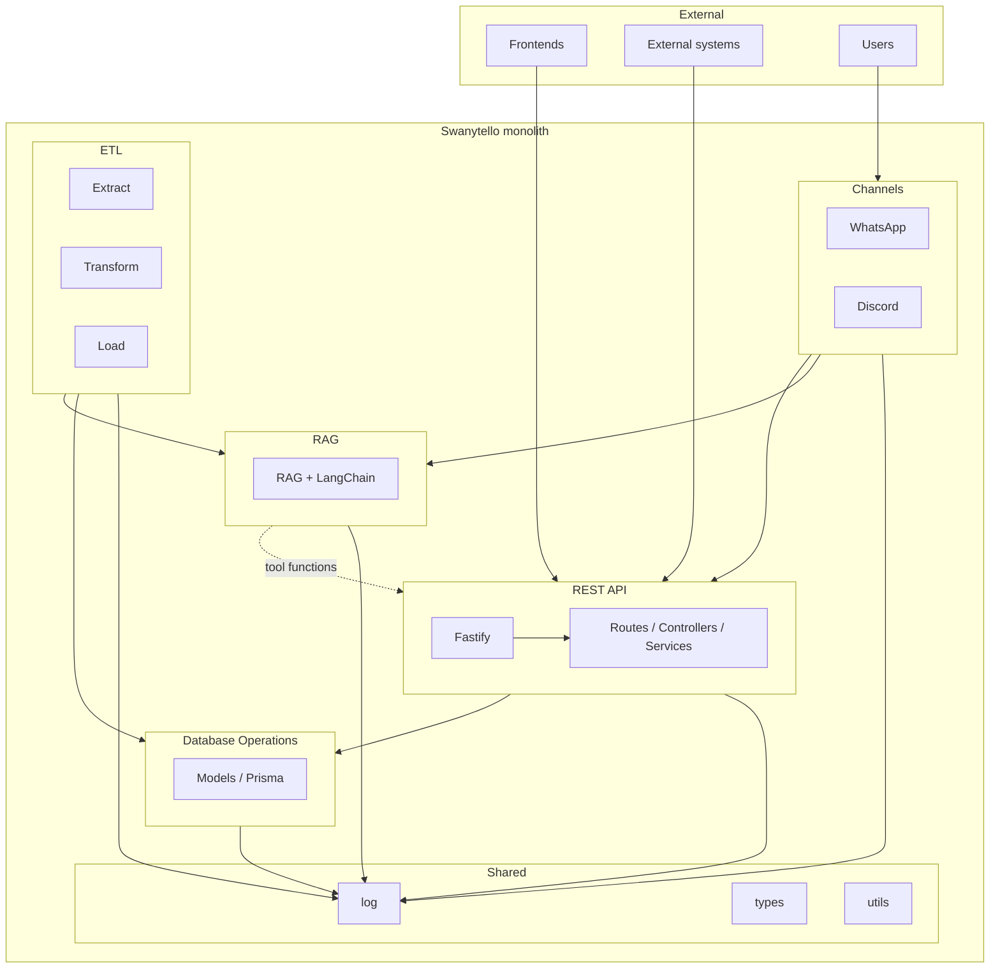
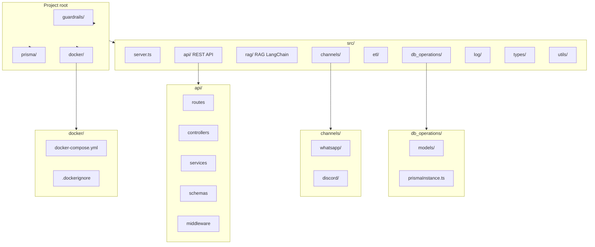

# Swanytello – Project structure (visual)

Render these diagrams at [mermaid.live](https://mermaid.live) or in any editor/docs tool that supports Mermaid.

**See also**: [Architecture Documentation](architecture.md) for detailed explanations of architectural decisions and component purposes.

---

## 1. Architecture (monolith)

How the main areas relate and who uses them.

---

## 2. Folder structure

Project root and `src/` layout. Guardrails live at root (for AI dev agents); RAG guardrails elsewhere.

---

## 3. Data flow (channels → API / RAG)

How messages from users reach the API and RAG.

