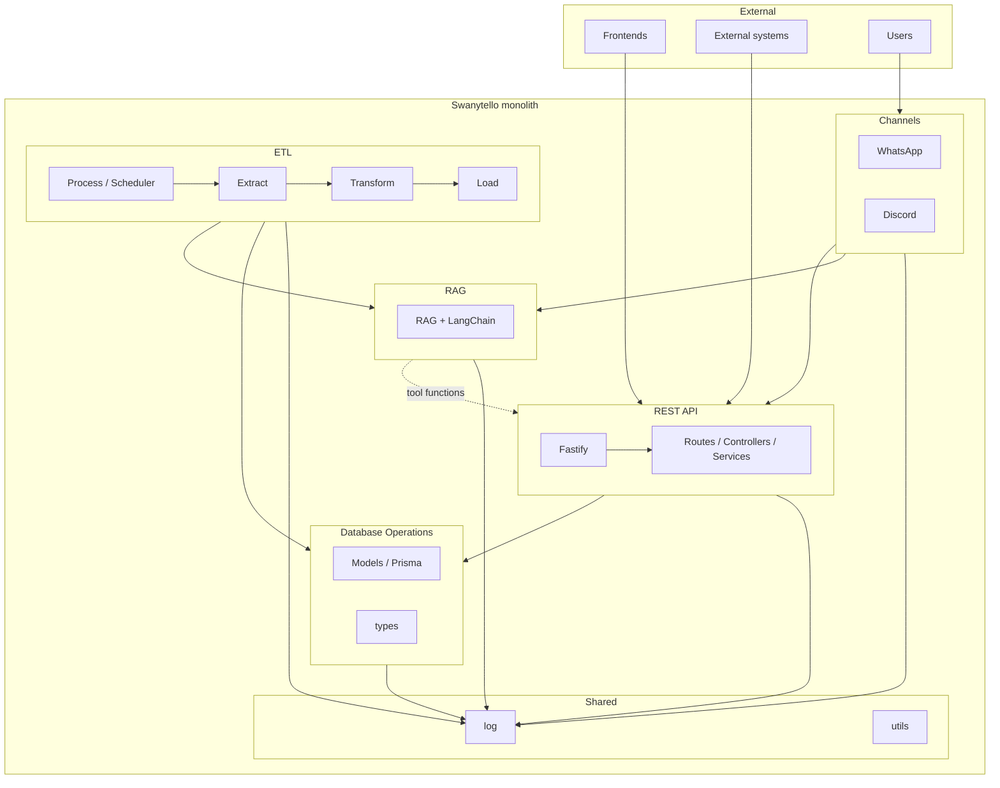
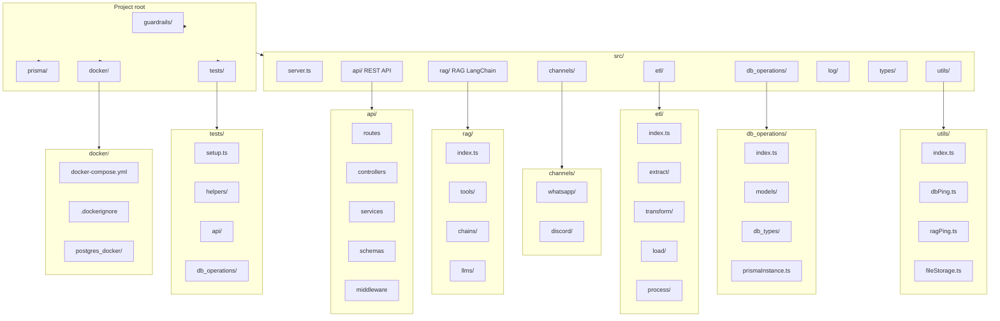
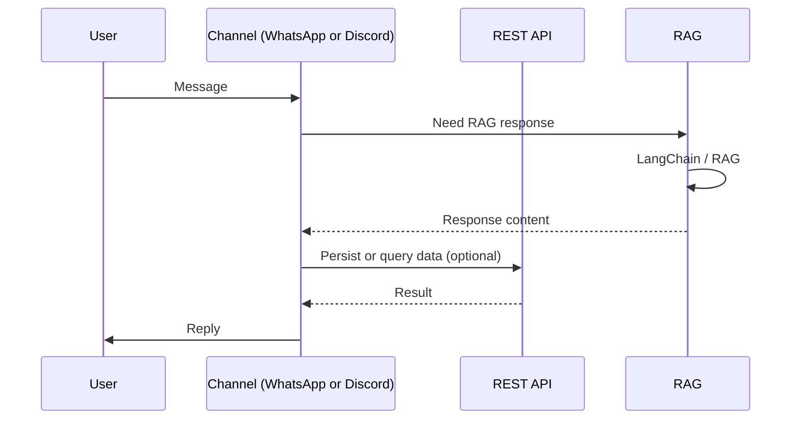
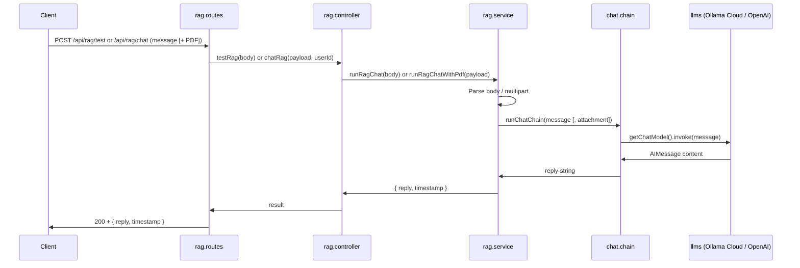
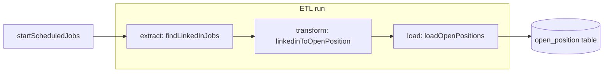
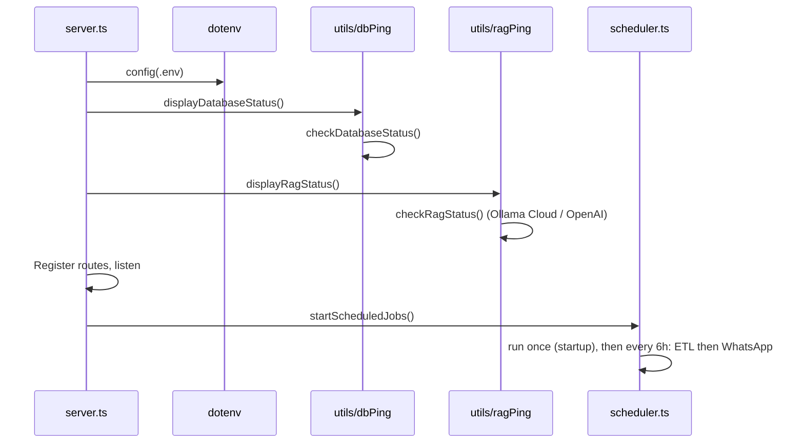
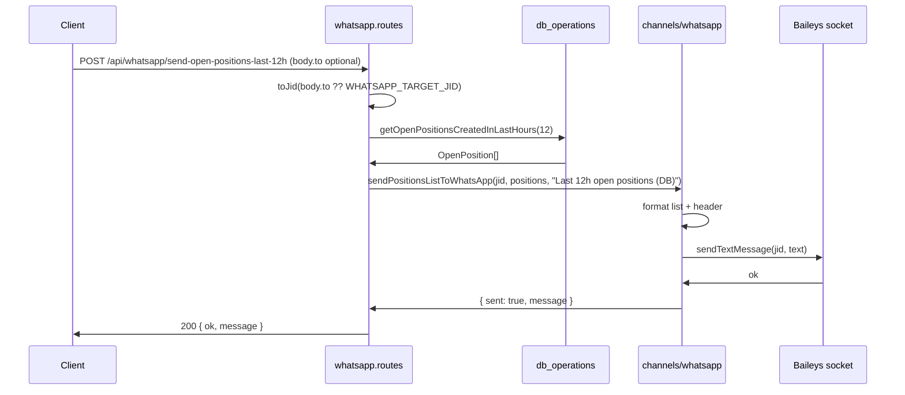

# Swanytello – Project structure (visual)

Render these diagrams at [mermaid.live](https://mermaid.live) or in any editor/docs tool that supports Mermaid.

**See also**: [Architecture Documentation](architecture.md) for detailed explanations of architectural decisions and component purposes.

---

## 1. Architecture (monolith)

How the main areas relate and who uses them.

---

## 2. Folder structure

Project root and `src/` layout. Guardrails live at root (for AI dev agents); RAG guardrails elsewhere.

---

## 3. Data flow (channels → API / RAG)

How messages from users reach the API and RAG.

---

## 4. RAG request flow (POST /api/rag/test or POST /api/rag/chat)

When a client calls the RAG test endpoint (JSON) or the RAG chat endpoint (multipart, optional PDF), the request flows through the API into the chat chain and the configured LLM (Ollama Cloud default or OpenAI via `getChatModel()`).

**See**: [RAG documentation](../rag.md) for usage, env vars, GET /api/rag/health, and how to change the LLM.

---

## 5. ETL process (LinkedIn jobs → open_position)

The ETL process runs **on startup** (once the server is listening) and **every 12 hours**. It extracts LinkedIn job listings, transforms them into `open_position` records, and loads them into the database (skipping duplicates by link).

**See**: [ETL README](../../src/etl/README.md) and [Architecture](architecture.md) (ETL section).

---

## 6. Startup sequence (DB + RAG checks and scheduler)

On startup, the server loads `.env`, runs the database and RAG connectivity checks, registers routes, listens, then starts the scheduled jobs (ETL then WhatsApp send; run once, then every 6h).

---

## 7. WhatsApp send last 12h (POST /api/whatsapp/send-open-positions-last-12h)

The API fetches open positions created in the last 12 hours from the database, then asks the WhatsApp channel to format and send them via Baileys. Used for testing the WhatsApp implementation.

