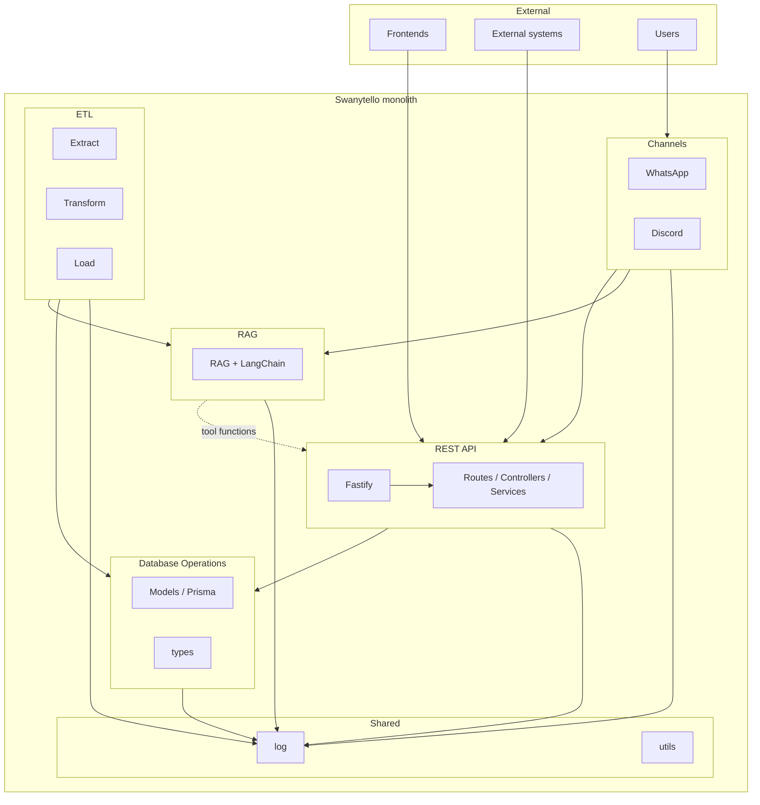
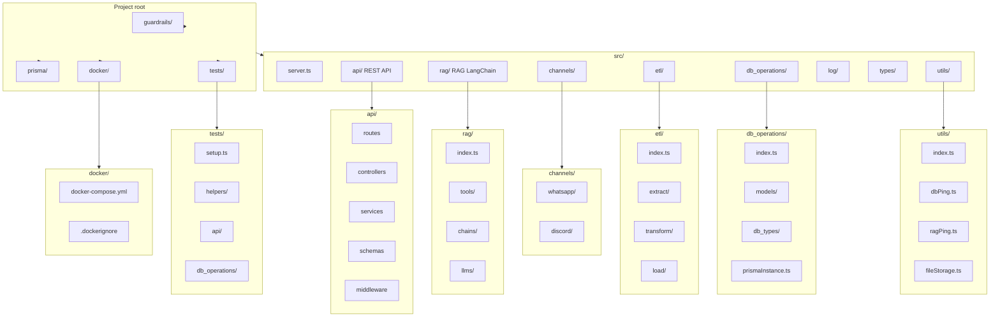
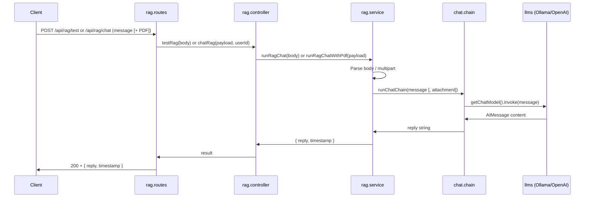
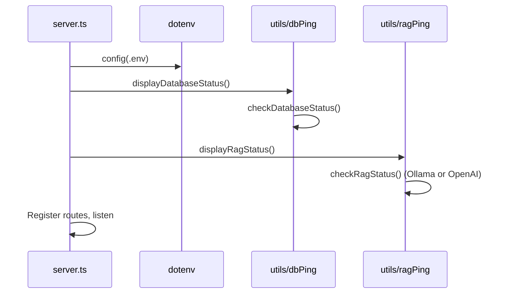

# Swanytello – Project structure (visual)

Render these diagrams at [mermaid.live](https://mermaid.live) or in any editor/docs tool that supports Mermaid.

**See also**: [Architecture Documentation](architecture.md) for detailed explanations of architectural decisions and component purposes.

---

## 1. Architecture (monolith)

How the main areas relate and who uses them.

---

## 2. Folder structure

Project root and `src/` layout. Guardrails live at root (for AI dev agents); RAG guardrails elsewhere.

---

## 3. Data flow (channels → API / RAG)

How messages from users reach the API and RAG.

---

## 4. RAG request flow (POST /api/rag/test or POST /api/rag/chat)

When a client calls the RAG test endpoint (JSON) or the RAG chat endpoint (multipart, optional PDF), the request flows through the API into the chat chain and the configured LLM (Ollama or OpenAI via `getChatModel()`).

**See**: [RAG documentation](../rag.md) for usage, env vars, GET /api/rag/health, and how to change the LLM.

---

## 5. Startup sequence (DB + RAG checks)

On startup, the server loads `.env`, then runs the database and RAG connectivity checks before registering routes and listening.

