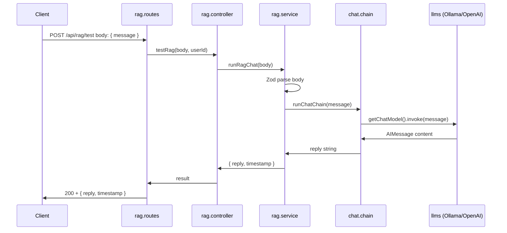

# RAG (Retrieval-Augmented Generation)

This document describes the RAG module in Swanytello: structure, usage, how to change the LLM, and how it fits into the architecture.

---

## Overview

RAG logic lives in **`src/rag/`** and uses **LangChain** for chains and LLM integrations. It is consumed by:

- The **REST API** (e.g. POST `/api/rag/test`) for testing and driving RAG from clients.
- **Channels** (WhatsApp, Discord), which can call into RAG when a user message needs an AI response.

RAG **never** accesses the database directly; it uses **API tool functions** when it needs data. See [Architecture](project_structure/architecture.md) for the full picture.

---

## Structure

```
src/rag/
├── index.ts
├── README.md
├── tools/       # Agent tools (API-backed; no direct DB)
├── chains/      # LangChain chains (orchestration, prompts, tool use)
└── llms/        # LLM integrations (Ollama, OpenAI, Claude, etc.)
```

| Folder | Purpose |
|--------|---------|
| **llms/** | Provider-specific chat models. Config via env. Export a LangChain-compatible instance or factory (e.g. `getOllamaChat()`). |
| **tools/** | Tools the agent can call (e.g. query data via API). No direct `db_operations` imports. |
| **chains/** | Chains that compose LLMs, prompts, and optional tools. Entry point for “user message → reply” (e.g. `runChatChain`). |

---

## RAG request flow (current)

When a client calls POST `/api/rag/test` with a message, the flow is:



---

## Usage

### Endpoint

- **Method/URL**: `POST /api/rag/test`
- **Auth**: Required. Send `Authorization: Bearer <JWT>` (or use `AUTH_STATUS=off` for local dev to bypass).
- **Body**: JSON with a required `message` field (string, 1–16384 characters).

**Example request**

```bash
curl -X POST http://localhost:3000/api/rag/test \
  -H "Authorization: Bearer YOUR_JWT" \
  -H "Content-Type: application/json" \
  -d '{"message": "Hello, how are you?"}'
```

**Example response (200)**

```json
{
  "reply": "The model's reply text here.",
  "timestamp": "2025-02-10T12:00:00.000Z"
}
```

**Validation error (400)** – Missing or invalid `message`:

```json
{
  "error": "Validation error",
  "details": [{ "path": ["message"], "message": "Required" }]
}
```

### Prerequisites

- **Ollama** (default): when `RAG_LLM_PROVIDER` is unset or `ollama`, Ollama must be running (e.g. `http://localhost:11434`). Install and start Ollama, then e.g. `ollama pull llama3.2`.
- **OpenAI**: when `RAG_LLM_PROVIDER=openai`, set `OPENAI_API_KEY` in `.env`. No local server needed.

---

## How to change the LLM

### Switch provider via .env (recommended)

Set **RAG_LLM_PROVIDER** in `.env` to choose the chat model. The chain uses `getChatModel()` from `src/rag/llms/` and needs no code change.

| Value | Provider | Required env |
|-------|----------|----------------|
| `ollama` (default) | Local Ollama | Optional: **OLLAMA_BASE_URL**, **OLLAMA_MODEL** |
| `openai` | OpenAI API | **OPENAI_API_KEY** (required). Optional: **OPENAI_MODEL** |

**Ollama** – `OLLAMA_BASE_URL` (default `http://localhost:11434`), `OLLAMA_MODEL` (default `llama3.2`).

**OpenAI** – `OPENAI_API_KEY` required; `OPENAI_MODEL` (default `gpt-4o-mini`).

### Add another provider (e.g. Claude)

1. Add a new file in `src/rag/llms/` (e.g. `claude.llm.ts`) with a `getClaudeChat()` that reads env and returns a LangChain chat model.
2. In `src/rag/llms/index.ts`, extend `getChatModel()` to support e.g. `RAG_LLM_PROVIDER=claude` and call the new getter.
3. Document the new env vars in `.env.example` and [src/rag/llms/README.md](../src/rag/llms/README.md).

---

## Security and boundaries

- RAG **does not** import from `src/db_operations/`. Data access goes through the API (tool functions).
- The API enforces JWT (or conditional auth) for `/api/rag/test`; do not disable auth in production.
- API keys and URLs for LLMs must come from environment variables, not hardcoded.

---

## See also

- [RAG folder README](../src/rag/README.md) – Structure and principles.
- [Architecture](project_structure/architecture.md) – Where RAG fits and tool-based DB access.
- [Project structure (visual)](project_structure/project-structure.md) – Mermaid diagrams.
- [API README](../src/api/README.md) – Protected endpoints including `/api/rag/test`.
