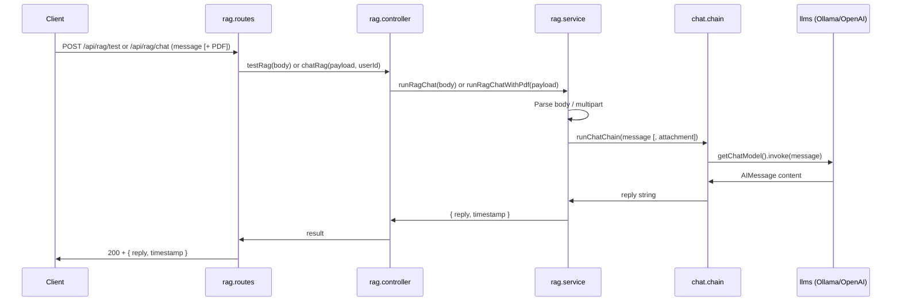

# RAG (Retrieval-Augmented Generation)

This document describes the RAG module in Swanytello: structure, usage, how to change the LLM, and how it fits into the architecture.

---

## Overview

RAG logic lives in **`src/rag/`** and uses **LangChain** for chains and LLM integrations. It is consumed by:

- The **REST API** for testing and driving RAG from clients:
  - **GET `/api/rag/health`** (public) – Checks that the configured LLM (Ollama or OpenAI) is reachable. Same check runs at startup.
  - **POST `/api/rag/test`** – JSON body with `message` only.
  - **POST `/api/rag/chat`** – Multipart form with `message` and optional **PDF** attachment (for future tag-extraction tooling).
- **Channels** (WhatsApp, Discord), which can call into RAG when a user message needs an AI response.

RAG **never** accesses the database directly; it uses **API tool functions** when it needs data. See [Architecture](project_structure/architecture.md) for the full picture.

---

## Structure

```
src/rag/
├── index.ts
├── README.md
├── tools/       # Agent tools (API-backed; no direct DB)
├── chains/      # LangChain chains (orchestration, prompts, tool use)
└── llms/        # LLM integrations (Ollama, OpenAI, Claude, etc.)
```

| Folder | Purpose |
|--------|---------|
| **llms/** | Provider-specific chat models. Config via env. Export a LangChain-compatible instance or factory (e.g. `getOllamaChat()`). |
| **tools/** | Tools the agent can call (e.g. query data via API). No direct `db_operations` imports. |
| **chains/** | Chains that compose LLMs, prompts, and optional tools. Entry point for “user message → reply” (e.g. `runChatChain`). |

---

## RAG request flow (current)

When a client calls POST `/api/rag/test` (JSON) or POST `/api/rag/chat` (multipart, optional PDF) with a message, the flow is:



---

## Usage

### Endpoints

| Endpoint | Content-Type | Use case |
|----------|--------------|----------|
| **POST /api/rag/test** | `application/json` | Message only. Body: `{ "message": "string" }`. |
| **POST /api/rag/chat** | `multipart/form-data` | Message + optional PDF. Fields: `message` (required), `pdf` (optional file). For future tag extraction from PDF. |

**Auth**: Both require `Authorization: Bearer <JWT>` (or use `AUTH_STATUS=off` for local dev to bypass).

**Example – message only (test)**

```bash
curl -X POST http://localhost:3000/api/rag/test \
  -H "Authorization: Bearer YOUR_JWT" \
  -H "Content-Type: application/json" \
  -d '{"message": "Hello, how are you?"}'
```

**Example – message + PDF (chat)**

```bash
curl -X POST http://localhost:3000/api/rag/chat \
  -H "Authorization: Bearer YOUR_JWT" \
  -F "message=Extract tags from this PDF" \
  -F "pdf=@/path/to/file.pdf"
```

**Example response (200)** – Same for both endpoints:

```json
{
  "reply": "The model's reply text here.",
  "timestamp": "2025-02-10T12:00:00.000Z"
}
```

**Validation error (400)** – Missing/invalid `message`, or (chat only) invalid/non-PDF file:

```json
{
  "error": "Validation error",
  "details": [{ "path": ["message"], "message": "Required" }]
}
```

**LLM unavailable (503)** – When the configured LLM is unreachable (e.g. Ollama not running, OpenAI API key invalid or network error), the API returns **503 Service Unavailable** with a short, actionable message instead of a generic 500. See [API endpoint docs](API/endpoints/rag-test.md#503-service-unavailable--llm-unreachable) for the response body.

Full request/response details, error cases, and examples: **[API Endpoints – RAG](API/endpoints/rag-test.md)** and **[API Endpoints – RAG Chat](API/endpoints/rag-chat.md)**.

### Prerequisites

- **Environment**: `.env` is loaded at startup (`dotenv/config` in `server.ts`). Set your provider and keys there.
- **Ollama**: used when `RAG_LLM_PROVIDER=ollama` (default when `OPENAI_API_KEY` is not set). Ollama must be running (e.g. `http://localhost:11434`). Install and start Ollama, then e.g. `ollama pull llama3.2`.
- **OpenAI**: used when `RAG_LLM_PROVIDER=openai` **or** when `RAG_LLM_PROVIDER` is unset and `OPENAI_API_KEY` is set in `.env`. No local server needed; set `OPENAI_API_KEY` (and optionally `OPENAI_MODEL`).

---

## How to change the LLM

### Switch provider via .env (recommended)

The chain uses `getChatModel()` from `src/rag/llms/` and needs no code change. Provider is chosen as follows:

1. If **RAG_LLM_PROVIDER** is set in `.env`, that value is used (`openai` or `ollama`).
2. If **RAG_LLM_PROVIDER** is not set and **OPENAI_API_KEY** is set, **OpenAI** is used.
3. Otherwise **Ollama** is used (default).

So you can use OpenAI by either setting `RAG_LLM_PROVIDER=openai` or by only setting `OPENAI_API_KEY` (no need to set `RAG_LLM_PROVIDER`).

| Value / condition | Provider | Required env |
|-------------------|----------|----------------|
| `ollama` or unset and no OPENAI_API_KEY | Local Ollama | Optional: **OLLAMA_BASE_URL**, **OLLAMA_MODEL** |
| `openai` or unset with OPENAI_API_KEY | OpenAI API | **OPENAI_API_KEY** (required). Optional: **OPENAI_MODEL** |

**Ollama** – `OLLAMA_BASE_URL` (default `http://localhost:11434`), `OLLAMA_MODEL` (default `llama3.2`).

**OpenAI** – `OPENAI_API_KEY` required; `OPENAI_MODEL` (default `gpt-4o-mini`).

### Add another provider (e.g. Claude)

1. Add a new file in `src/rag/llms/` (e.g. `claude.llm.ts`) with a `getClaudeChat()` that reads env and returns a LangChain chat model.
2. In `src/rag/llms/index.ts`, extend `getChatModel()` to support e.g. `RAG_LLM_PROVIDER=claude` and call the new getter.
3. Document the new env vars in `.env.example` and [src/rag/llms/README.md](../src/rag/llms/README.md).

---

## Security and boundaries

- RAG **does not** import from `src/db_operations/`. Data access goes through the API (tool functions).
- The API enforces JWT (or conditional auth) for `/api/rag/test`; do not disable auth in production.
- API keys and URLs for LLMs must come from environment variables, not hardcoded.

---

## See also

- [RAG folder README](../src/rag/README.md) – Structure and principles.
- [Architecture](project_structure/architecture.md) – Where RAG fits and tool-based DB access.
- [Project structure (visual)](project_structure/project-structure.md) – Mermaid diagrams.
- [API Documentation](API/README.md) – Index of all API endpoints; [rag-test](API/endpoints/rag-test.md) and [rag-chat](API/endpoints/rag-chat.md) for RAG.
- [API README](../src/api/README.md) – Protected endpoints and code structure.
