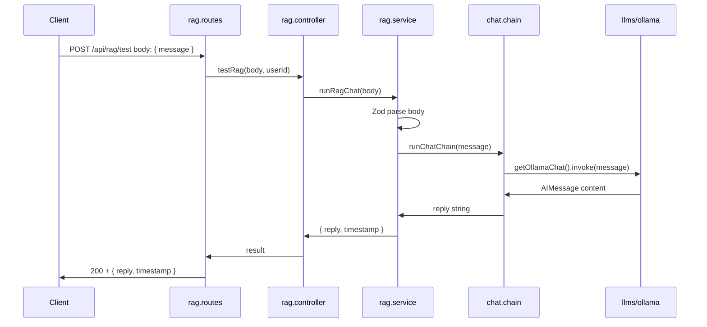

# RAG (Retrieval-Augmented Generation)

This document describes the RAG module in Swanytello: structure, usage, how to change the LLM, and how it fits into the architecture.

---

## Overview

RAG logic lives in **`src/rag/`** and uses **LangChain** for chains and LLM integrations. It is consumed by:

- The **REST API** (e.g. POST `/api/rag/test`) for testing and driving RAG from clients.
- **Channels** (WhatsApp, Discord), which can call into RAG when a user message needs an AI response.

RAG **never** accesses the database directly; it uses **API tool functions** when it needs data. See [Architecture](project_structure/architecture.md) for the full picture.

---

## Structure

```
src/rag/
├── index.ts
├── README.md
├── tools/       # Agent tools (API-backed; no direct DB)
├── chains/      # LangChain chains (orchestration, prompts, tool use)
└── llms/        # LLM integrations (Ollama, OpenAI, Claude, etc.)
```

| Folder | Purpose |
|--------|---------|
| **llms/** | Provider-specific chat models. Config via env. Export a LangChain-compatible instance or factory (e.g. `getOllamaChat()`). |
| **tools/** | Tools the agent can call (e.g. query data via API). No direct `db_operations` imports. |
| **chains/** | Chains that compose LLMs, prompts, and optional tools. Entry point for “user message → reply” (e.g. `runChatChain`). |

---

## RAG request flow (current)

When a client calls POST `/api/rag/test` with a message, the flow is:



---

## Usage

### Endpoint

- **Method/URL**: `POST /api/rag/test`
- **Auth**: Required. Send `Authorization: Bearer <JWT>` (or use `AUTH_STATUS=off` for local dev to bypass).
- **Body**: JSON with a required `message` field (string, 1–16384 characters).

**Example request**

```bash
curl -X POST http://localhost:3000/api/rag/test \
  -H "Authorization: Bearer YOUR_JWT" \
  -H "Content-Type: application/json" \
  -d '{"message": "Hello, how are you?"}'
```

**Example response (200)**

```json
{
  "reply": "The model's reply text here.",
  "timestamp": "2025-02-10T12:00:00.000Z"
}
```

**Validation error (400)** – Missing or invalid `message`:

```json
{
  "error": "Validation error",
  "details": [{ "path": ["message"], "message": "Required" }]
}
```

### Prerequisites

- **Ollama** must be running when using the default LLM (e.g. at `http://localhost:11434`). Install and start Ollama locally, and pull a model (e.g. `ollama pull llama3.2`).

---

## How to change the LLM

### Option 1: Configure Ollama (current default)

The default chain uses **Ollama** via `src/rag/llms/ollama.ts`. Configure it with environment variables:

| Variable | Default | Description |
|----------|---------|-------------|
| **OLLAMA_BASE_URL** | `http://localhost:11434` | Ollama server URL. |
| **OLLAMA_MODEL** | `llama3.2` | Model name (e.g. `llama3.2`, `mistral`, `llama3.1:8b`). |

Set these in `.env` or your environment. No code change required.

### Option 2: Add a new LLM provider (e.g. OpenAI, Claude)

1. **Implement the provider in `src/rag/llms/`**
   - Add a new file (e.g. `openai.ts` or `claude.ts`).
   - Create a LangChain-compatible chat model (e.g. `ChatOpenAI`, `ChatAnthropic`) using env for API keys and model name.
   - Export a factory or singleton (e.g. `getOpenAIChat()`).

2. **Use it in the chain**
   - In `src/rag/chains/chat.chain.ts`, import the new LLM instead of (or in addition to) `getOllamaChat()`.
   - You can switch by env: e.g. `RAG_LLM_PROVIDER=ollama|openai|claude` and call the appropriate getter in the chain.

3. **Document env vars**
   - Add the new provider’s env vars to `.env.example` and to [src/rag/llms/README.md](../src/rag/llms/README.md).

### Option 3: Switch chain to another provider in code

To use a different provider without adding a generic “provider” env:

- In `chat.chain.ts`, replace `getOllamaChat()` with the other getter (e.g. `getOpenAIChat()`).
- Ensure the chosen provider’s env vars (API keys, base URL, model) are set.

---

## Security and boundaries

- RAG **does not** import from `src/db_operations/`. Data access goes through the API (tool functions).
- The API enforces JWT (or conditional auth) for `/api/rag/test`; do not disable auth in production.
- API keys and URLs for LLMs must come from environment variables, not hardcoded.

---

## See also

- [RAG folder README](../src/rag/README.md) – Structure and principles.
- [Architecture](project_structure/architecture.md) – Where RAG fits and tool-based DB access.
- [Project structure (visual)](project_structure/project-structure.md) – Mermaid diagrams.
- [API README](../src/api/README.md) – Protected endpoints including `/api/rag/test`.
